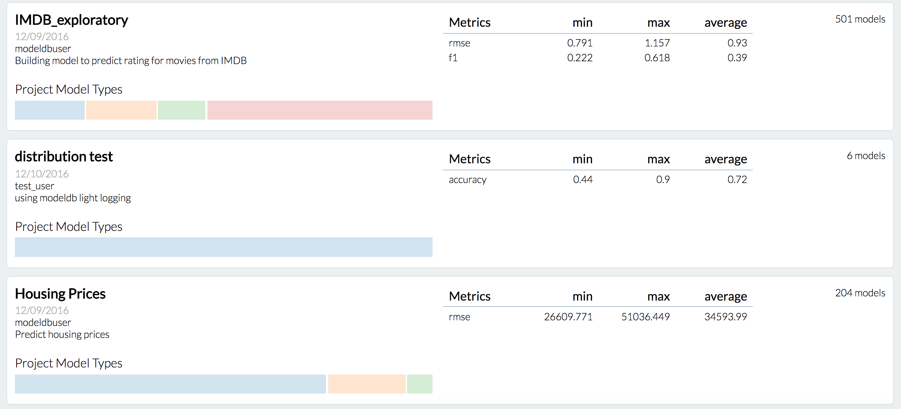
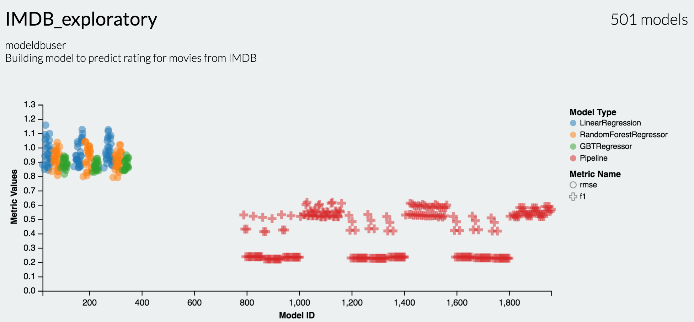
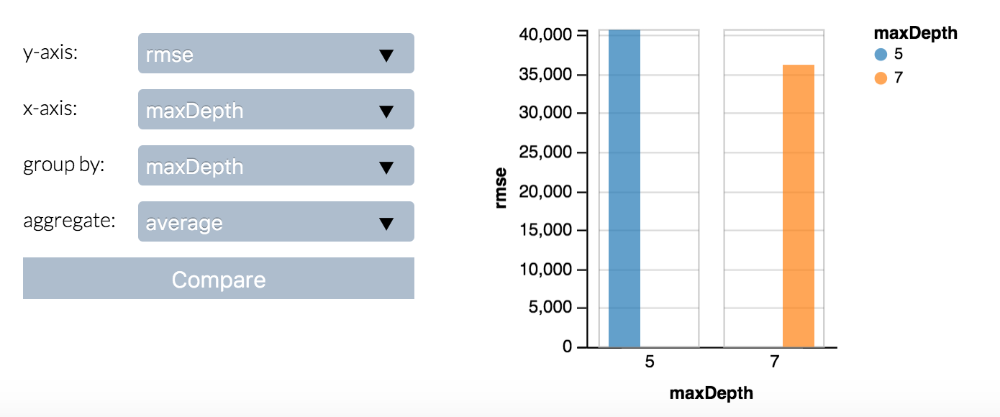

# ModelDB: A system to manage ML models
[](https://travis-ci.org/mitdbg/modeldb)
**Website**: [http://modeldb.csail.mit.edu](http://modeldb.csail.mit.edu)

**See the ModelDB frontend in action**:

[](https://youtu.be/gxBb4CjJcxQ "Watch the ModelDB frontend in action")

## Contents

- [Overview](#overview)
    - [How Does it Work?](#how-does-it-work)
- [News](#news)
- [Setup and Installation](#setup-and-installation)
- [Usage and Samples](#usage-and-samples)
    - [Incorporate ModelDB into your ML workflow](#incorporate-modeldb-into-your-ml-workflow)
    - [View your models in ModelDB](#view-your-models-in-modeldb)
- [Documentation](#documentation)
- [Contact Us](#contact-us)
- [Contributing](#contributing)

## Overview
ModelDB is an end-to-end system to manage machine learning models. It ingests models and associated metadata as models are being trained, stores model data in a structured format, and surfaces it through a web-frontend for rich querying. ModelDB can be used with **any ML environment** via the ModelDB Light API. ModelDB native clients can be used for advanced support in `spark.ml` and `scikit-learn`.

The ModelDB frontend provides rich summaries and graphs showing model data. The frontend provides functionality to slice and dice this data along various attributes (e.g. operations like filter by hyperparameter, group by datasets) and to build custom charts showing model performance.

<br>
ModelDB Frontend Projects Summary Page

<br>
ModelDB Graph for Model Metrics

<br>
ModelDB Configurable Graph Parameters

### How does it work?

[ModelDB's Light API](client/python/light_api.md) can be used with any ML environment to sync model metrics and metadata or even entire config files by calling a few functions (e.g. see [here](client/python/samples/basic/BasicWorkflow.py) and [here](client/python/samples/basic/BasicSyncAll.py) respectively).

Alternatively, ModelDB native clients for  ```spark.ml``` and ```scikit-learn``` can be used to perform automatic, fine-grained logging. Unlike the Light API, native clients do not require the user to explicitly provide model data to ModelDB. The native clients can automatically extract relevant pieces of model data *as the model is being built* and sync them with ModelDB. Incorporating ModelDB into a scikit-learn / spark.ml workflow is as simple as appending `Sync` or `_sync` to relevant methods in the respective libraries. See samples for spark.ml [here](client/scala/libs/spark.ml#samples) and those for scikit-learn [here](client/python/scikit_learn.md).

## News

2017.02.08: ModelDB publicly available! Try it out and contribute.

## Setup and Installation

Watch a video of the setup and installation process [here](https://youtu.be/rmNnG3-bd6s).

1. **Clone the repo**

    ```git
    git clone https://github.com/mitdbg/modeldb
    ```

2. **Install dependencies**

    ModelDB requires Linux or MacOS. The code below shows how you can install the dependencies on each of them. A detailed list of all the dependencies with the recommended and required versions can be found [here](docs/required_software.md).

    Depending on the client you're using, we assume you have the following already installed:
    - scikit-learn client:
        - Python 2.7\*\*
        - [pip](https://pip.pypa.io/en/stable/installing/)
        - [scikit-learn](http://scikit-learn.org/stable/install.html) 0.17\*\*
    - spark.ml client:
        - Java 1.8+
        - Spark 2.0.0\*\*

    **(\*\*) = Must have exact version**

    On OSX, we also assume that you have [homebrew](https://brew.sh/) installed.

    **On Mac OSX:**

    ```bash
    # Use homebrew to install the dependencies
    brew install sqlite
    brew install maven
    brew install node
    brew install sbt # for spark.ml client only
    brew install mongodb

    # ModelDB works only with Thrift 0.9.3 and 0.10.0. If you do not have thrift installed, install via brew.
    brew install thrift

    pip install -r [path_to_modeldb]/client/python/requirements.txt
    ```

    **On Linux:**

    ```bash
    apt-get update
    sudo apt-get install sqlite
    sudo apt-get install maven
    sudo apt-get install sbt # for spark.ml client only
    sudo apt-get install nodejs # may need to symlink node to nodejs. "cd /usr/bin; ln nodejs node"
    sudo apt-get install -y mongodb-org # further instructions here: https://docs.mongodb.com/manual/tutorial/install-mongodb-on-ubuntu/

    # install thrift. [path_to_thrift] is the installation directory
    # ModelDB works with thrift 0.9.3 and 0.10.0. The following instructions are for 0.9.3
    cd [path_to_thrift]
    wget http://mirror.cc.columbia.edu/pub/software/apache/thrift/0.9.3/thrift-0.9.3.tar.gz
    tar -xvzf thrift-0.9.3.tar.gz
    cd thrift-0.9.3
    ./configure
    make
    export PATH=[path_to_thrift]/:$PATH

    pip install -r [path_to_modeldb]/client/python/requirements.txt
    ```

    For Linux, you can also refer to [this script](https://github.com/mitdbg/modeldb/blob/master/docs/install_on_linux.sh).

3. **Build**

    ModelDB is composed of three components: the ModelDB **server**, the ModelDB **client libraries**, and the ModelDB **frontend**.

    In the following, **[path_to_modeldb]** refers to the directory into which you have cloned the modeldb repo and **[thrift_version]** is 0.9.3 or 0.10.0 depending on your thrift version (check by running ```thrift -version```).

    ```bash
    # run the script to set up the sqlite and the mongodb databases that modeldb will use
    # this also starts mongodb
    # ***IMPORTANT NOTE: This clears any previous modeldb databases. This should only be done once.***
    cd [path_to_modeldb]/server/codegen
    ./gen_sqlite.sh

    # build and start the server
    cd ..
    ./start_server.sh [thrift_version] &
    # NOTE: if you are building the project in eclipse, you may need to uncomment the pluginManagement tags in pom.xml located in the server directory

    # build scikit-learn client library
    cd [path_to_modeldb]/client/python
    ./build_client.sh

    # build spark.ml client library
    cd [path_to_modeldb]/client/scala/libs/spark.ml
    ./build_client.sh

    # start the frontend
    cd [path_to_modeldb]/frontend
    ./start_frontend.sh & # the frontend will now be available in http://localhost:3000/

    # ****** For server shutdown ******
    # Kill server
    # Shutdown mongodb server
    mongo --eval "db.getSiblingDB('admin').shutdownServer()"
    ```

## Usage and Samples

### Incorporate ModelDB into your ML workflow
- [Light API](client/python/light_api.md)
- [scikit-learn](client/python/scikit_learn.md)
- [spark.ml](docs/getting_started/spark_ml.md)

### View your models in ModelDB
After incorporating ModelDB into your models, follow these steps to run and view them in ModelDB.

1. **Make sure the server is running.**

    Each time you use ModelDB, the server, including MongoDB for the database, must be up and running.

    ```bash
    # start the server
    cd [path_to_modeldb]/server
    ./start_server.sh [thrift_version] &

    # make sure mongodb is running. if not running, execute the commands below
    # cd codegen
    # mkdir -p mongodb
    # mongod --dbpath mongodb
    ```

2. **Run your models instrumented with ModelDB as shown [above](#incorporate-modeldb-into-your-ml-workflow).**

3. **View, visualize, and query your models.**

    You can view all these models in [http:localhost:3000/](http:localhost:3000/) by starting the frontend.

    ```bash
    cd [path_to_modeldb]/frontend
    ./start_frontend.sh &
    ```

## Documentation
More comprehensive documentation on ModelDB, including answers to FAQ, will be available soon in [the wiki](https://github.com/mitdbg/modeldb/wiki). Information about the server documentation can be found in the [docs folder](docs). For other questions, don't hesitate to contact us.

## Contact Us
Questions? Bugs? We're happy to talk about all things ModelDB! Reach out to modeldb *at* lists.csail.mit.edu or post in the ModelDB [Google Group](https://groups.google.com/forum/#!forum/modeldb).

## Contributing
Contributions are welcome! Please read [this](CONTRIBUTING.md) to get started.

