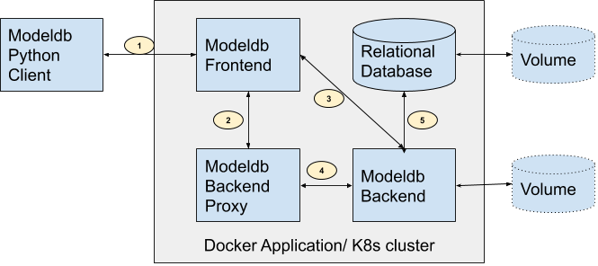

# ModelDB: An open-source system for Machine Learning model versioning, metadata, and experiment management.
----

<p align="center">
  <a href="https://hub.docker.com/u/vertaaiofficial">
    
  </a>
  <a href="https://pypi.org/project/verta/">
    
  </a>
  <a href="https://anaconda.org/conda-forge/verta">
    
  </a>
  <a href="https://github.com/VertaAI/modeldb/blob/master/LICENSE">
    
  </a>
  <br>
  <a href="https://hub.docker.com/u/vertaaiofficial">
    
  </a>
  <a href="https://pypi.org/project/verta/">
    
  </a>
  <a href="https://github.com/VertaAI/modeldb/graphs/commit-activity">
    
  </a>
  <a href="https://github.com/VertaAI/modeldb/graphs/commit-activity">
    
  </a>
  <br>
  <a href="https://github.com/VertaAI/modeldb/graphs/commit-activity">
    
  </a>
  <a href="https://twitter.com/intent/follow?screen_name=VertaAI">
    
  </a>
  <a href="http://bit.ly/modeldb-mlops">
    
  </a>
</p>


<h3 align="center">
  <a href="#up-and-running-in-5-minutes">Quickstart</a>
  <span> · </span>
  <a href="https://docs.verta.ai/en/master/tutorials/workflow.html">Workflow</a>
  <span> · </span>
  <a href="https://docs.verta.ai/en/master/examples.html">Examples</a>
  <span> · </span>
  <a href="#contributions">Contribute</a>
  <span> · </span>
  <a href="http://bit.ly/modeldb-mlops">Support (Slack)</a>
</h3>

----
ModelDB is an open-source system to version machine learning models including their ingredients code, data, config, and environment and to track ML metadata across the model lifecycle.

Use ModelDB in order to:
* Make your ML models reproducible
* Manage your ML experiments, build performance dashboards, and share reports
* Track models across their lifecycle including development, deployment, and live monitoring

Features:
* Works on Docker, Kubernetes
* Clients in Python and Scala
* Beautiful dashboards for model performance and reporting
* Git-like operations on any model
* Flexible metadata logging including metrics, artifacts, tags and user information
* Pluggable storage systems
* Integration into state-of-the-art frameworks like Tensorflow and PyTorch
* Battle-tested in production environments

If you are looking for a hosted version of ModelDB, please reach out at modeldb@verta.ai.

This version of ModelDB is built upon its predecessor from [CSAIL, MIT](https://www.csail.mit.edu/). The previous version can be found on Github [here](https://github.com/VertaAI/modeldb/releases/tag/v1.0.0). The ModelDB project is now maintained by [Verta.ai](https://verta.ai).

----

## What’s In This Document

- [Up and Running in 5 minutes](#up-and-running-in-5-minutes)
- [Documentation](#documentation)
- [Community](#community)
- [Architecture](#architecture)
- [How to Contribute](#how-to-contribute)
- [License](#license)
- [Thanks to Our Contributors](#thanks)

----

## Up and Running in 5 minutes

0. Install [Docker](https://docs.docker.com/compose/install/) (and Docker Compose)


1. Setup ModelDB via Docker Compose

```bash
docker-compose -f docker-compose-all.yaml up
```
*Note: modeldb-backend service needs backend/config/config.yaml to run, either clone the repo before running docker-compose or create the file manually.*

2. Install the ModelDB pip package. *Note it comes packaged in the verta package.*
```bash
pip install verta
```

3. Version a model or log a workflow. *Alternatively, run any of the detailed [examples](https://docs.verta.ai/en/master/examples.html) in our repository.*

```python
from verta import Client
client = Client("http://localhost:3000")

proj = client.set_project("My first ModelDB project")
expt = client.set_experiment("Default Experiment")

# log the first run
run = client.set_experiment_run("First Run")
run.log_hyperparameters({"regularization" : 0.5})
# ... model training code goes here
run.log_metric('accuracy', 0.72)

# log the second run
run = client.set_experiment_run("Second Run")
run.log_hyperparameters({"regularization" : 0.8})
# ... model training code goes here
run.log_metric('accuracy', 0.83)
```

**That's it!** Navigate to **<http://localhost:3000>** to find the ModelDB Web UI and check out the models you just logged.


----

For information on debugging the Docker-based ModelDB installation, check [here](DEPLOY.md#Deploy-pre-published-images).


**Other ways to install ModelDB are:**

1. [Building the source code and deploying](DEPLOY.md#build-images-from-source-and-deploy)
1. [Deploy on kubernetes via helm](DEPLOY.md#kubernetes-setUp)
1. [Using a ModelDB ami](DEPLOY.md#AWS)
1. If you are looking for a hosted version of ModelDB, please reach out at modeldb@verta.ai.

----

## Documentation

Official documentation for ModelDB can be found [here](https://docs.verta.ai/en/master/).

----

## Community

For Getting Started guides, Tutorials, and API reference check out our [docs](https://docs.verta.ai/en/master/).

To report a bug, file a documentation issue, or submit a feature request, please open a GitHub issue.

For help, questions, contribution discussions and release announcements, please join us on [Slack](http://bit.ly/modeldb-mlops).

----

## Architecture

At a high level the architecture of ModelDB in a Kubernetes cluster or a Docker application looks as below:



- **ModelDB Client** available in Python and Scala which can instantiated in the user's model building code and exposes functions to store information to ModelDB.
- **ModelDB Frontend**  developed in JavaScript and typescript is the visual reporting module of ModelDB. It also acts as an entry point for the ModelDB cluster.
  - It receives the request from client (1) and the browser and route them to the appropriate container.
  - The gRPC calls (2) for creating, reading,updating or deleting Projects, Experiments, ExperimentRuns, Dataset, DatasetVersions or their metadata are routed to ModelDB Proxy.
  - The HTTP calls (3) for storing and retrieving binary artifacts are forwarded directly to backend.
- **ModelDB Backend Proxy** developed in golang is a light weight gRPC to Http convertor.
  - It receives the gRPC request from the front end (2) and sends them to backend (4). In the other direction it converts the response from backend and sends it to the frontend.
- **ModelDB Backend** developed in java is module which stores, retrieves or deletes information as triggered by user via the client or the front end.
  - It exposes gRPC endpoints (4) for most of the operations which is used by the proxy.
  - It has http endpoints (3) for storing, retrieving and deleting artifacts used directly by the frontend.
- **Database** ModelDB Backend stores (5) the information from the requests it receive into a Relational database.
  - Out of the box ModelDB is configured and verified to work against PostgreSQL, but since it uses Hibernate as a ORM and liquibase for change management, it should be easy to configure ModelDB to run on another SQL Database supported by the the tools.

*Volumes : The relational database and the artifact store in backend need volumes attached to enable persistent storage.*

### Repo Structure

Each module in the architecture diagram has a designated folder in this repository, and has their own README covering in depth documentation and contribution guidelines.

1. **protos** has the protobuf definitions of the objects and endpoint used across ModelDB. More details [here](protos/README.md).
1. **backend** has the source code and tests for ModelDB Backend. It also holds the proxy at **backend/proxy**. More details [here](backend/README.md).
1. **client** has the source code and tests for ModelDB client. More details [here](client/README.md).
1. **webapp** has the source and tests for ModelDB frontend. More details [here](webapp/README.md).

Other supporting material for deployment and documentation is at:

1. **chart** has the helm chart to deploy ModelDB onto your Kubernetes cluster. More details [here](chart/modeldb/README.md).
1. **doc-resources** has images for documentation.

----

## Contributions

As seen from the [Architecture](#architecture) ModelDB provides a full stack solution to tracking, versioning and auditing  machine learning models.
We are open to contributions to any of the modules in form of Pull Requests.

The main skill sets for each module are as below:

1. backend: If you are interested in `Java` development or are interested in database design using technologies like `Hibernate` and `Liquibase` please take a look at [backend README](backend/README.md) for setup and development instructions.
1. client: If you are interested in `Python` or `Scala` development or are interested in building examples notebooks on various ML frameworks logging data to Modeldb please take a look at [client CONTRIBUTING guide](client/CONTRIBUTING.md) for contribution instructions.
1. frontend: If you are interested  in `Node`,`React` or `Redux` based development please take a look at [webapp README](webapp/README.md)

Please reach out to us in [slack](http://bit.ly/modeldb-mlops) for any assistance in getting started with the development set up or any other feedback.

----

## License

ModelDB is licensed under Apache 2.0.

----

## Thanks

Thanks to our many contributors and users.
